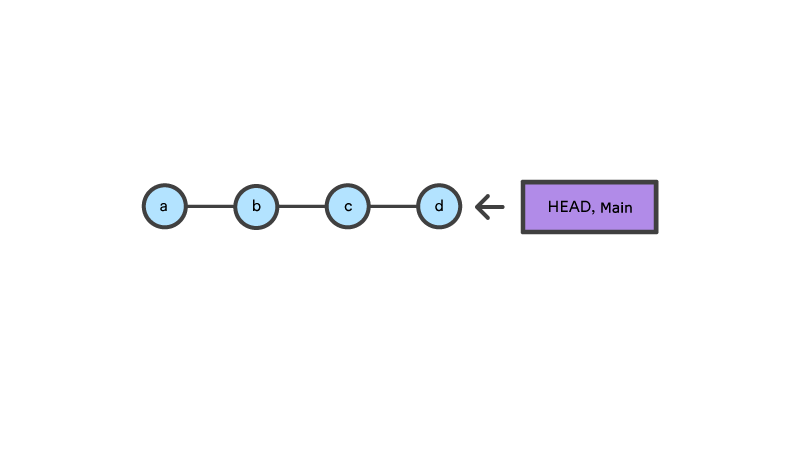
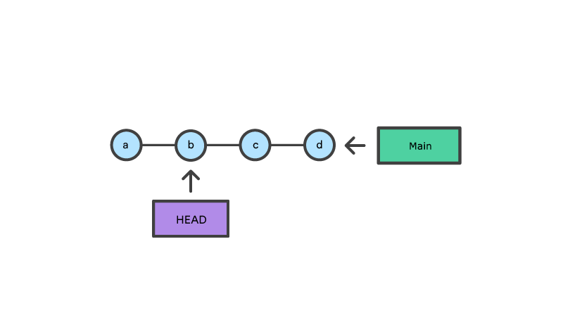
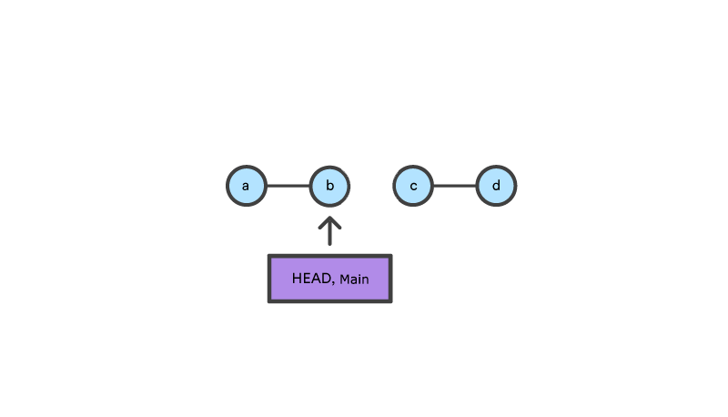

# Git

## 介绍

### 内部状态管理

Git 的内部状态管理机制，也被称为[“三棵树”][git-tools-reset-demystified]，实际上，这是一种误称，因为它们并不是严格意义上的树形结构，而是基于节点和指针的结构，Git 使用这种结构，来跟踪状态时间线的变更。


- Workspace 工作区，本地项目所在的目录，开发中我们直接操作的，就是这个目录下的所有内容。
- Index 暂存区，这是一个临时区域，存放着下一次提交内容的修改，当执行 `git add` 命令时，工作区内容的修改就会被暂存到这个区，此时，暂存区中的文件被标记为 “Staged”。注意，暂存区中的所有内容，会被当作下一次提交。
- Repository（HEAD）本地仓库区，存放着完整的提交历史记录。当执行 `git commit` 命令时，暂存区中所有未被提交的内容，会被记录到一个新的快照中，并被提交到这个区。本地仓库中的 “HEAD” 指针，指向当前分支的最后一次提交。

### HEAD 指针（TODO）

`git checkout` 或者 `git reset` 会修改 HEAD 的指向。

[git-tools-reset-demystified]: https://git-scm.com/book/ms/v2/Git-Tools-Reset-Demystified

## 常用操作

### 撤销

#### `git revert`（撤销）

##### 撤销单个commit

```bash
git revert [commit]
```

- **作用**：创建新commit来撤销指定commit的更改
- **适用**：已推送到远程的commit
- **风险**：低，保留历史记录

##### 撤销多个commits

```bash
git revert <commit1> <commit2> <commit3>
```

- **作用**：撤销多个commits
- **适用**：需要撤销多个已推送的commits

##### 撤销范围

```bash
git revert <oldest-commit>..<newest-commit>
```

- **作用**：撤销一个范围的commits
- **注意**：不包含oldest-commit本身

#### `git reset`（重置）

`git reset` 通过修改工作区、暂存区和提交历史记录，来撤销对本地内容的修改。该命令一般常用的格式有两种。

```bash
git reset [command] HEAD~[n]

# 或者
git reset [command] [commit]
```

上面的两个命令都表示，将 HEAD 指针移动到指定的 commit。其中，第一个命令中的 `[n]`，表示将 HEAD 移动到它前面的第 n 个提交；第二个命令中的 `[commit]`，是某次提交的哈希值。

`git reset` 有三个可选的 `[command]` 参数，下面分别对他们进行介绍。

##### `--soft`

`git reset --soft` 表示软重置，该参数的行为如下。

- 移动 HEAD 指向特定的 `[commit]`。
- 工作区不会发生任何变化，`[commit]` 之后的提交（即原始的 HEAD 和新的 HEAD 之间的内容）重新回到暂存区（状态为已暂存，staged）。
- 这会将 `[commit]` 之后提交的内容变为“未提交的更新”，就像你刚提交了某个特定的 commit，然后对这些“未提交的更新”做出了修改，并执行了 `git add` 一样。

假设在某一时刻，在 `main` 分支有三个提交，其中最后一次提交（`abc1234`）对 `file.text` 文件进行了修改操作。

```bash
# 假设当前状态
git log --oneline
# abc1234 (HEAD) 最新提交
# def5678 第二个提交
# ghi9012 第一个提交
```

然后执行 `git reset --soft HEAD~1` 命令。

```bash
# 执行软重置
git reset --soft HEAD~1

# 执行后的状态
git log --oneline
# def5678 (HEAD) 第二个提交
# ghi9012 第一个提交
```

查看当前分支的最新状态。

```bash
git status
# On branch main
# Changes to be committed:
#   modified:   file.txt
```

上面的代码，由于执行了 `git reset --soft HEAD~1`，导致 HEAD 指向了第二次提交，这就使得最后一次提交（`abc1234`）的内容回到了暂存区。此时，再次此执行 `git commit` 命令，一个新的提交记录就会被创建。

从上面的过程可以看出，`git reset --soft` 是一个安全的操作，不会丢失任何内容。因此，可以在下面这些场景使用这个命令。

- 重新编辑提交信息。
- 撤销最近的提交信息，但保留更改。
- 合并多个提交信息。比如，将最近的三个提交合并为一个，就可以使用下面的操作。

```bash
git reset --soft HEAD~3
git commit -m "合并后的提交信息"
```

重新编辑提交信息时，除了使用 `git reset --soft`，还可以使用 `git commit --amend -m "新的提交信息"` 命令，不过前者更灵活。

另外，单独使用 `git reset --soft HEAD` 命令，还可以用来清空暂存区，然后重新选择要提交的文件。

下面的例子中，工作区有三个文件被修改，此时，执行 `git add .` 将这些更改存放到暂存区。

```bash
git add .
git status
# Changes to be committed:
#   modified: file1.txt
#   modified: file2.txt
#   modified: file3.txt
```

执行完上面的操作后，突然发现 `file3.txt` 这个文件不应该被暂存，于是就可以使用下面的命令清空暂存区。

```bash
git reset --soft HEAD
git add file1.txt file2.txt  # 只暂存需要的文件
git commit -m "只提交file1和file2"
```

这样，只有 `file1.text` 和 `file2.text` 被暂存。

##### `--mixed`

`git reset --mixed [commit]` 表示混合重置，该参数的行为如下。

- 移动 HEAD 指向特定的 `[commit]`。
- `[commit]` 之后的提交重新回到工作区（状态为未暂存，unstaged），对应暂存区中的内容被移除。

假设在某一时刻，在 `main` 分支有三个提交，第二个提交对 `file1.text` 进行了修改，最新的提交创建了一个新的文件 `file2.text`。

```bash
# 假设当前状态
git log --oneline
# abc1234 (HEAD) 最新提交
# def5678 第二个提交
# ghi9012 目标提交
```

然后执行 `git reset --mixed` 命令。

```bash
# 执行混合重置
git reset --mixed ghi9012

# 执行后的状态
git log --oneline
# ghi9012 (HEAD) 目标提交 ← HEAD 移动到这里
```

查看当前分支的最新状态。

```bash
git status
# On branch main
# Changes not staged for commit:
#   modified: file1.txt  ← 从暂存区移到工作区
# Untracked files:
#   file2.txt  ← 从暂存区移到工作区
```

上面的代码，由于执行了 `git reset --mixed`，导致 HEAD 指向了目标提交，这使得后最近的两次提交（`def5678` 和 `abc1234`）的内容重新回到了工作区。此时，执行 `git add .` 和 `git commit` 命令，一个新的提交记录就会被创建。

从上面的过程可以看出，`git reset --mixed` 是一个安全的操作，不会丢失任何内容。因此，该命令可以用来重新选择要提交的文件。

注意，`git reset --mixed [commit]` 可以简写为 `git reset [commit]`，也就是说，`git reset` 默认就是 mixed 模式。

##### `--hard`

`git reset --hard [commit]` 表示混合重置，该参数的行为如下。

- 移动 HEAD 指向特定的 `[commit]`。
- 工作区中所有未暂存的内容和暂存区中所有未提交的内容都被删除。

假设在某一时刻，在 `main` 分支有三个提交。

```bash
# 假设当前状态
git log --oneline
# abc1234 (HEAD) 最新提交
# def5678 第二个提交
# ghi9012 目标提交
```

然后执行 `git reset --hard` 命令。

```bash
# 执行硬重置
git reset --hard ghi9012

# 执行后的状态
git log --oneline
# ghi9012 (HEAD) 目标提交 ← HEAD 移动到这里
```

查看当前分支的最新状态。

```bash
git status
# On branch main
# nothing to commit, working tree clean
# 所有更改都丢失了！
```

执行完 `git reset --hard` 命令后，工作区、暂存区和本地仓库中 `ghi9012` 之后的提交都被删除了。

从上面的过程可以看出，`git reset --hard` 是一个危险的操作，除非你知道自己在做什么，否则应该避免使用这个命令。如果不小心使用了该命令，可以通过 `git reflog` 恢复。

第一步，执行 `git reflog` 查看历史记录。

```bash
git reflog
# ghi9012 HEAD@{0}: reset: moving to ghi9012
# abc1234 HEAD@{1}: commit: 最新提交
# def5678 HEAD@{2}: commit: 第二个提交
# ghi9012 HEAD@{3}: commit: 目标提交
```

第二步，找到要恢复的提交。从 reflog 历史记录中可以看出，`HEAD@{1}` 指向 `abc1234`，这是我们想要恢复的状态，`HEAD@{0}` 是当前的硬重置操作。

最后，再次执行 `git reset --hard` 恢复到之前的状态。

```bash
# 恢复到硬重置之前的状态
git reset --hard HEAD@{1}

# 或者直接使用提交的哈希值
git reset --hard abc1234
```

查看提交历史记录，可以看到已经恢复到了之前的状态。

```bash
# 检查是否恢复成功
git log --oneline
# abc1234 (HEAD) 最新提交
# def5678 第二个提交
# ghi9012 目标提交
```

下面是这三个命令的作用范围。


## 特定场景操作

### 撤销提交

git revert

git rebase

git rebase（变基）

交互式rebase

```bash
git rebase -i HEAD~3
```

- **作用**：可以删除、编辑、重排commits
- **适用**：本地未推送的commits
- **风险**：中等，需要谨慎操作

删除特定commit

```bash
# 在rebase交互界面中删除对应行
pick abc1234 commit message 1
drop def5678 commit message 2  # 删除这行
pick ghi9012 commit message 3
```

git cherry-pick（挑选）

反向cherry-pick

```bash
git revert [commit]
# 然后
git cherry-pick <revert-commit>
```

- **作用**：选择性应用撤销更改
- **适用**：复杂的撤销场景

git filter-branch（过滤分支）

从历史中完全移除

```bash
git filter-branch --index-filter 'git rm --cached --ignore-unmatch <file>' HEAD
```

- **作用**：从整个历史中移除文件或commit
- **适用**：需要彻底清理历史记录
- **风险**：高，会重写历史

git rebase --onto（选择性变基）

移除中间commit

```bash
git rebase --onto <parent-commit> <commit-to-remove> <branch>
```

- **作用**：移除指定commit，保留其他commits
- **适用**：移除中间的commit

git reset + force push（强制推送）

本地重置后强制推送

```bash
git reset --hard HEAD~1
git push --force-with-lease origin <branch>
```

- **作用**：强制更新远程分支
- **风险**：高，会覆盖远程历史
- **注意**：使用`--force-with-lease`更安全

git commit --amend（修改最近commit）

修改最近commit

```bash
git commit --amend -m "new message"
```

- **作用**：修改最近commit的内容或信息
- **适用**：只修改最后一个commit

git rebase --interactive（交互式变基）

详细操作步骤

```bash
git rebase -i HEAD~5
```

在编辑器中：

- `pick`：保留commit
- `drop`：删除commit
- `squash`：合并到前一个commit
- `edit`：暂停编辑commit
- `reword`：修改commit信息

## 机制

### `git checkout` vs `git reset`

表面上看，`git reset` 和 `git checkout` 命令相似。但他们之间有很大区别，`git checkout` 仅操作 HEAD 指针，而 `git reset` 同时操作 HEAD 和当前分支指针。

比如，在 `main` 分支上有一系列提交，当前，HEAD 和 `main` 同时指向提交 `d`。



执行 `git checkout b`，此时，`main` 依然指向 `d` 提交，而 HEAD 则指向了 `b` 提交，该仓库现在处于“HEAD 分离”状态。指针指向如下图所示。



执行 `git reset b`，此时，`main` 和 HEAD 指针同时指向了 `b` 提交。此时的指针指向如下图所示。



除了修改当前分支和 HEAD 的指向，`git reset` 还会对 Git 的工作区、暂存区和提交历史记录状态进行修改，实现方式是通过 [git reset](#git-reset重置) 的 `--soft`、`--mixed` 和 `--hard` 三个命令完成。

## 参考

- [Git Tutorials](https://www.atlassian.com/git), atlassian
- [常用 Git 命令清单](https://www.ruanyifeng.com/blog/2015/12/git-cheat-sheet.html), 阮一峰
