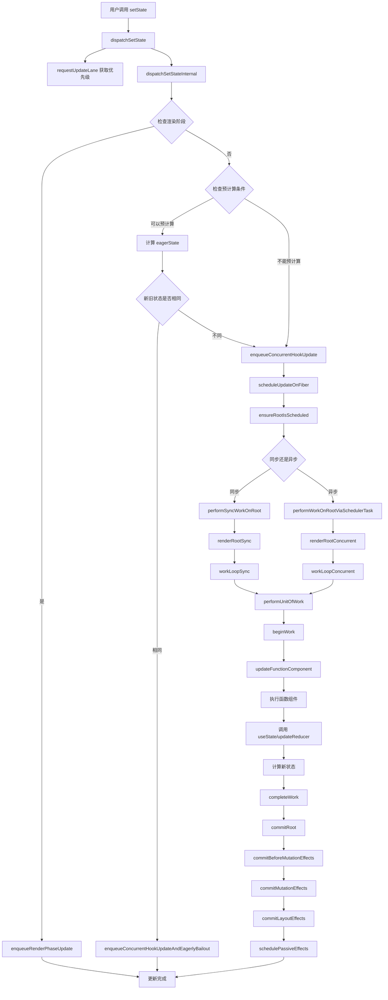

# setState 的执行流程

## 一、概述

在 React 函数组件中，执行 `setState` 方法时，会触发一个复杂的更新流程，这个流程涉及创建更新对象、加入更新队列、请求调度、执行渲染、计算新状态、提交更改等多个步骤。

## 二、数据结构定义

### Hook

```jsx
// packages/react-reconciler/src/ReactFiberHooks.js
export type Hook = {
  memoizedState: any, // 当前状态值
  baseState: any, // 基础状态值（用于状态计算的起点）
  baseQueue: Update<any, any> | null, // 基础更新队列
  queue: any, // 更新队列
  next: Hook | null, // 指向下一个 hook 的指针
};
```

### 更新对象

```jsx
// packages/react-reconciler/src/ReactFiberHooks.js
export type Update<S, A> = {
  lane: Lane, // 优先级车道
  revertLane: Lane, // 回滚车道
  action: A, // 更新动作（新状态值或状态更新函数）
  hasEagerState: boolean, // 是否有预计算状态
  eagerState: S | null, // 预计算的状态值
  next: Update<S, A>, // 指向下一个更新的指针
};
```

### 更新队列

```jsx
// packages/react-reconciler/src/ReactFiberHooks.js
export type UpdateQueue<S, A> = {
  pending: Update<S, A> | null, // 待处理的更新链表
  lanes: Lanes, // 更新的优先级车道
  dispatch: (A => mixed) | null, // dispatch 函数引用
  lastRenderedReducer: ((S, A) => S) | null, // 最后渲染时使用的 reducer
  lastRenderedState: S | null, // 最后渲染的状态
};
```

## 三、setState 执行流程

### 3.1 `useState` 初始化

当组件首次渲染时，`useState` 会创建相应的数据结构。

```typescript
// packages/react-reconciler/src/ReactFiberHooks.js
function mountState<S>(
  initialState: (() => S) | S,
): [S, Dispatch<BasicStateAction<S>>] {
  const hook = mountWorkInProgressHook();
  
  if (typeof initialState === 'function') {
    initialState = initialState();
  }
  
  hook.memoizedState = hook.baseState = initialState;
  
  // 创建更新队列
  const queue: UpdateQueue<S, BasicStateAction<S>> = {
    pending: null,
    lanes: NoLanes,
    dispatch: null,
    lastRenderedReducer: basicStateReducer,
    lastRenderedState: (initialState: any),
  };
  hook.queue = queue;
  
  // 创建 dispatch 函数，绑定当前 fiber 和队列
  const dispatch: Dispatch<BasicStateAction<S>> = (queue.dispatch = (
    dispatchSetState.bind(
      null,
      currentlyRenderingFiber,
      queue,
    ): any));
    
  return [hook.memoizedState, dispatch];
}
```

### 3.2 调用 `setState` 触发 `dispatchSetState`

当用户代码调用 `setState(newValue)` 时，实际调用的是 `dispatchSetState` 函数。

```typescript
// packages/react-reconciler/src/ReactFiberHooks.js
function dispatchSetState<S, A>(
  fiber: Fiber,
  queue: UpdateQueue<S, A>,
  action: A,
): void {
  const lane = requestUpdateLane(fiber);
  
  const didScheduleUpdate = dispatchSetStateInternal(
    fiber,
    queue,
    action,
    lane,
  );
  
  // 如果调度了更新，启动更新计时器
  if (didScheduleUpdate) {
    startUpdateTimerByLane(lane);
  }
}
```

### 3.3 `dispatchSetStateInternal` 处理更新

`dispatchSetStateInternal` 方法是 `setState` 的核心逻辑。

```typescript
// packages/react-reconciler/src/ReactFiberHooks.js
function dispatchSetStateInternal<S, A>(
  fiber: Fiber,
  queue: UpdateQueue<S, A>,
  action: A,
  lane: Lane,
): boolean {
  // 创建更新对象
  const update: Update<S, A> = {
    lane,
    revertLane: NoLane,
    action,
    hasEagerState: false,
    eagerState: null,
    next: (null: any),
  };

  // 检查是否是渲染阶段更新
  if (isRenderPhaseUpdate(fiber)) {
    enqueueRenderPhaseUpdate(queue, update);
  } else {
    const alternate = fiber.alternate;
    
    // 检查是否可以进行预计算优化
    if (
      fiber.lanes === NoLanes &&
      (alternate === null || alternate.lanes === NoLanes)
    ) {
      // 队列当前为空，可以预先计算下一个状态
      const lastRenderedReducer = queue.lastRenderedReducer;
      if (lastRenderedReducer !== null) {
        try {
          const currentState: S = (queue.lastRenderedState: any);
          // 预计算新状态
          const eagerState = lastRenderedReducer(currentState, action);
          
          // 存储预计算结果
          update.hasEagerState = true;
          update.eagerState = eagerState;
          
          // 如果新状态和当前状态相同，可以跳过渲染
          if (is(eagerState, currentState)) {
            // 快速路径：无需重新渲染
            enqueueConcurrentHookUpdateAndEagerlyBailout(fiber, queue, update);
            return false;
          }
        } catch (error) {
          // 抑制错误，在渲染阶段会重新抛出
        }
      }
    }

    // 将更新加入队列并调度
    const root = enqueueConcurrentHookUpdate(fiber, queue, update, lane);
    if (root !== null) {
      scheduleUpdateOnFiber(root, fiber, lane);
      entangleTransitionUpdate(root, queue, lane);
      return true;
    }
  }
  return false;
}
```

### 3.4 `requestUpdateLane` 获取优先级

```typescript
// packages/react-reconciler/src/ReactFiberWorkLoop.js
export function requestUpdateLane(fiber: Fiber): Lane {
  // 特殊情况处理
  const mode = fiber.mode;
  if (!disableLegacyMode && (mode & ConcurrentMode) === NoMode) {
    return (SyncLane: Lane);
  } else if (
    (executionContext & RenderContext) !== NoContext &&
    workInProgressRootRenderLanes !== NoLanes
  ) {
    // 渲染阶段更新，使用当前渲染车道
    return pickArbitraryLane(workInProgressRootRenderLanes);
  }

  // 检查是否在transition中
  const transition = requestCurrentTransition();
  if (transition !== null) {
    const actionScopeLane = peekEntangledActionLane();
    return actionScopeLane !== NoLane
      ? actionScopeLane
      : requestTransitionLane(transition);
  }

  // 根据事件优先级返回对应车道
  return eventPriorityToLane(resolveUpdatePriority());
}
```

## 更新队列处理

### 3.5 `enqueueConcurrentHookUpdate` 入队更新

```typescript
// packages/react-reconciler/src/ReactFiberConcurrentUpdates.js
export function enqueueConcurrentHookUpdate<S, A>(
  fiber: Fiber,
  queue: HookQueue<S, A>,
  update: HookUpdate<S, A>,
  lane: Lane,
): FiberRoot | null {
  const concurrentQueue: ConcurrentQueue = (queue: any);
  const concurrentUpdate: ConcurrentUpdate = (update: any);
  
  // 将更新加入并发队列
  enqueueUpdate(fiber, concurrentQueue, concurrentUpdate, lane);
  
  // 返回根节点以便后续调度
  return getRootForUpdatedFiber(fiber);
}

function enqueueUpdate(
  fiber: Fiber,
  queue: ConcurrentQueue | null,
  update: ConcurrentUpdate | null,
  lane: Lane,
) {
  // 暂时存储在全局数组中，稍后处理
  concurrentQueues[concurrentQueuesIndex++] = fiber;
  concurrentQueues[concurrentQueuesIndex++] = queue;
  concurrentQueues[concurrentQueuesIndex++] = update;
  concurrentQueues[concurrentQueuesIndex++] = lane;

  // 合并车道
  concurrentlyUpdatedLanes = mergeLanes(concurrentlyUpdatedLanes, lane);

  // 立即更新fiber的lanes字段
  fiber.lanes = mergeLanes(fiber.lanes, lane);
  const alternate = fiber.alternate;
  if (alternate !== null) {
    alternate.lanes = mergeLanes(alternate.lanes, lane);
  }
}
```

### 3.6 `finishQueueingConcurrentUpdates` 处理队列

```typescript
// packages/react-reconciler/src/ReactFiberConcurrentUpdates.js
export function finishQueueingConcurrentUpdates(): void {
  const endIndex = concurrentQueuesIndex;
  concurrentQueuesIndex = 0;
  concurrentlyUpdatedLanes = NoLanes;

  let i = 0;
  while (i < endIndex) {
    const fiber: Fiber = concurrentQueues[i];
    concurrentQueues[i++] = null;
    const queue: ConcurrentQueue = concurrentQueues[i];
    concurrentQueues[i++] = null;
    const update: ConcurrentUpdate = concurrentQueues[i];
    concurrentQueues[i++] = null;
    const lane: Lane = concurrentQueues[i];
    concurrentQueues[i++] = null;

    if (queue !== null && update !== null) {
      const pending = queue.pending;
      if (pending === null) {
        // 这是第一个更新，创建循环链表
        update.next = update;
      } else {
        // 插入到循环链表中
        update.next = pending.next;
        pending.next = update;
      }
      queue.pending = update;
    }

    if (lane !== NoLane) {
      markUpdateLaneFromFiberToRoot(fiber, update, lane);
    }
  }
}
```

## 调度和渲染

### 3.7 `scheduleUpdateOnFiber` 调度更新

```typescript
// packages/react-reconciler/src/ReactFiberWorkLoop.js
export function scheduleUpdateOnFiber(
  root: FiberRoot,
  fiber: Fiber,
  lane: Lane,
) {
  // 检查是否需要中断当前渲染
  if (
    (root === workInProgressRoot &&
      (workInProgressSuspendedReason === SuspendedOnData ||
        workInProgressSuspendedReason === SuspendedOnAction)) ||
    root.cancelPendingCommit !== null
  ) {
    // 中断当前渲染，从头开始
    prepareFreshStack(root, NoLanes);
    markRootSuspended(root, workInProgressRootRenderLanes, workInProgressDeferredLane, false);
  }

  // 标记根节点有待处理的更新
  markRootUpdated(root, lane);

  // 检查执行上下文
  if ((executionContext & RenderContext) !== NoLanes && root === workInProgressRoot) {
    // 渲染阶段更新的特殊处理
    warnAboutRenderPhaseUpdatesInDEV(fiber);
  } else if (
    (executionContext & RenderContext) === NoContext &&
    (includesSyncLane(lane) || (enableSwipeTransition && isGestureRender(lane)))
  ) {
    // 同步更新，立即刷新
    flushSyncWorkOnAllRoots();
  }

  // 确保根节点被调度
  ensureRootIsScheduled(root);
}
```

### 3.8 `performWorkOnRoot` 执行渲染工作

```typescript
// packages/react-reconciler/src/ReactFiberRootScheduler.js
function performWorkOnRoot(root: FiberRoot, lanes: Lanes, forceSync: boolean) {
  // 刷新被动效果
  const didFlushPassiveEffects = flushPendingEffects(true);
  if (didFlushPassiveEffects) {
    return null;
  }

  // 确定是否使用时间切片
  const shouldTimeSlice =
    (!forceSync &&
      !includesBlockingLane(lanes) &&
      !includesExpiredLane(root, lanes)) ||
    (enableSiblingPrerendering && checkIfRootIsPrerendering(root, lanes));

  // 选择渲染模式
  let exitStatus = shouldTimeSlice
    ? renderRootConcurrent(root, lanes)
    : renderRootSync(root, lanes, true);

  // 处理渲染结果
  do {
    if (exitStatus === RootInProgress) {
      // 渲染仍在进行中
      break;
    } else if (exitStatus === RootIncomplete) {
      // 渲染未完成，可能需要重试
      continue;
    } else if (exitStatus === RootErrored) {
      // 渲染出错
      const originallyAttemptedLanes = lanes;
      const errorRetryLanes = getLanesToRetrySynchronouslyOnError(root, originallyAttemptedLanes);
      if (errorRetryLanes !== NoLanes) {
        lanes = errorRetryLanes;
        exitStatus = recoverFromConcurrentError(root, originallyAttemptedLanes, errorRetryLanes);
        continue;
      }
    }
    break;
  } while (true);

  // 完成根节点工作
  finishConcurrentRender(root, exitStatus, finishedWork, lanes);
}
```

### 3.9 `renderRootSync`/`renderRootConcurrent` 渲染根节点

```typescript
// packages/react-reconciler/src/ReactFiberWorkLoop.js
function renderRootSync(root: FiberRoot, lanes: Lanes, shouldYieldToRenderer: boolean) {
  const prevExecutionContext = executionContext;
  executionContext |= RenderContext;

  // 准备新的工作栈
  if (workInProgressRoot !== root || workInProgressRootRenderLanes !== lanes) {
    prepareFreshStack(root, lanes);
  }

  // 执行工作循环
  outer: do {
    try {
      if (workInProgressSuspendedReason !== NotSuspended && workInProgress !== null) {
        // 处理挂起的工作
        const unitOfWork = workInProgress;
        const thrownValue = workInProgressThrownValue;
        resumeSuspendedUnitOfWork(unitOfWork, thrownValue);
      }
      workLoopSync();
      break;
    } catch (thrownValue) {
      handleThrow(root, thrownValue);
    }
  } while (true);

  // 完成渲染
  executionContext = prevExecutionContext;
  workInProgressRoot = null;
  workInProgressRootRenderLanes = NoLanes;

  // 处理并发更新队列
  finishQueueingConcurrentUpdates();

  return workInProgressRootExitStatus;
}
```

### 3.10 `workLoopSync` 工作循环

```typescript
// packages/react-reconciler/src/ReactFiberWorkLoop.js
function workLoopSync() {
  // 执行工作，不检查是否需要让出
  while (workInProgress !== null) {
    performUnitOfWork(workInProgress);
  }
}

function performUnitOfWork(unitOfWork: Fiber): void {
  const current = unitOfWork.alternate;
  
  const next = beginWork(current, unitOfWork, entangledRenderLanes);

  unitOfWork.memoizedProps = unitOfWork.pendingProps;
  if (next === null) {
    // 如果没有子节点，完成这个单元的工作
    completeUnitOfWork(unitOfWork);
  } else {
    // 继续处理子节点
    workInProgress = next;
  }
}
```

## 状态计算和提交

### 3.11 `updateFunctionComponent` 处理函数组件

```typescript
// packages/react-reconciler/src/ReactFiberBeginWork.js
function updateFunctionComponent(
  current: Fiber | null,
  workInProgress: Fiber,
  Component: any,
  nextProps: any,
  renderLanes: Lanes,
) {
  // 准备上下文
  prepareToReadContext(workInProgress, renderLanes);
  
  // 执行函数组件
  const nextChildren = Component(nextProps);

  // 协调子节点
  reconcileChildren(current, workInProgress, nextChildren, renderLanes);
  return workInProgress.child;
}
```

### 3.12 `updateReducer` 计算新状态

当函数组件执行时，会调用`useState`，此时会执行`updateReducer`：

```typescript
// packages/react-reconciler/src/ReactFiberHooks.js
function updateReducer<S, I, A>(
  reducer: (S, A) => S,
  initialArg: I,
  init?: I => S,
): [S, Dispatch<A>] {
  const hook = updateWorkInProgressHook();
  return updateReducerImpl(hook, ((currentHook: any): Hook), reducer);
}

function updateReducerImpl<S, A>(
  hook: Hook,
  current: Hook,
  reducer: (S, A) => S,
): [S, Dispatch<A>] {
  const queue = hook.queue;
  queue.lastRenderedReducer = reducer;

  // 获取基础队列和待处理队列
  let baseQueue = hook.baseQueue;
  const pendingQueue = queue.pending;
  
  if (pendingQueue !== null) {
    // 合并待处理队列到基础队列
    if (baseQueue !== null) {
      const baseFirst = baseQueue.next;
      const pendingFirst = pendingQueue.next;
      baseQueue.next = pendingFirst;
      pendingQueue.next = baseFirst;
    }
    current.baseQueue = baseQueue = pendingQueue;
    queue.pending = null;
  }

  if (baseQueue !== null) {
    // 处理更新队列
    const first = baseQueue.next;
    let newState = hook.baseState;
    
    let newBaseState = null;
    let newBaseQueueFirst = null;
    let newBaseQueueLast = null;
    let update = first;
    
    do {
      const updateLane = update.lane;
      const updateEventTime = update.eventTime;
      
      if (!isSubsetOfLanes(renderLanes, updateLane)) {
        // 优先级不足，跳过这个更新
        const clone: Update<S, A> = {
          lane: updateLane,
          action: update.action,
          hasEagerState: update.hasEagerState,
          eagerState: update.eagerState,
          next: (null: any),
        };
        
        if (newBaseQueueLast === null) {
          newBaseQueueFirst = newBaseQueueLast = clone;
          newBaseState = newState;
        } else {
          newBaseQueueLast = newBaseQueueLast.next = clone;
        }
        
        // 更新剩余车道
        currentlyRenderingFiber.lanes = mergeLanes(
          currentlyRenderingFiber.lanes,
          updateLane,
        );
        markSkippedUpdateLanes(updateLane);
      } else {
        // 处理这个更新
        if (newBaseQueueLast !== null) {
          const clone: Update<S, A> = {
            lane: NoLane,
            action: update.action,
            hasEagerState: update.hasEagerState,
            eagerState: update.eagerState,
            next: (null: any),
          };
          newBaseQueueLast = newBaseQueueLast.next = clone;
        }

        // 计算新状态
        const action = update.action;
        if (update.hasEagerState) {
          // 使用预计算的状态
          newState = ((update.eagerState: any): S);
        } else {
          // 使用reducer计算新状态
          newState = reducer(newState, action);
        }
      }
      update = update.next;
    } while (update !== null && update !== first);

    // 更新hook状态
    if (newBaseQueueLast === null) {
      newBaseState = newState;
    } else {
      newBaseQueueLast.next = (newBaseQueueFirst: any);
    }

    // 检查状态是否改变
    if (!is(newState, hook.memoizedState)) {
      markWorkInProgressReceivedUpdate();
    }

    hook.memoizedState = newState;
    hook.baseState = newBaseState;
    hook.baseQueue = newBaseQueueLast;

    queue.lastRenderedState = newState;
  }

  const dispatch: Dispatch<A> = (queue.dispatch: any);
  return [hook.memoizedState, dispatch];
}
```

### 3.13 `completeWork` 完成工作

```typescript
// packages/react-reconciler/src/ReactFiberCompleteWork.js
function completeWork(
  current: Fiber | null,
  workInProgress: Fiber,
  renderLanes: Lanes,
): Fiber | null {
  const newProps = workInProgress.pendingProps;

  switch (workInProgress.tag) {
    case FunctionComponent:
    case ForwardRef:
    case SimpleMemoComponent:
    case Block:
      // 函数组件不需要特殊的完成工作
      bubbleProperties(workInProgress);
      return null;
      
    case HostComponent:
      // DOM节点的处理
      const type = workInProgress.type;
      if (current !== null && workInProgress.stateNode != null) {
        // 更新现有节点
        updateHostComponent(current, workInProgress, type, newProps, renderLanes);
      } else {
        // 创建新节点
        const rootContainerInstance = getRootHostContainer();
        const instance = createInstance(type, newProps, rootContainerInstance, currentHostContext, workInProgress);
        appendAllChildren(instance, workInProgress, false, false);
        workInProgress.stateNode = instance;
      }
      bubbleProperties(workInProgress);
      return null;
      
    // ... 其他情况
  }
}
```

### 3.14 `commitRoot` 提交更改

```typescript
// packages/react-reconciler/src/ReactFiberCommitWork.js
function commitRootImpl(
  root: FiberRoot,
  recoverableErrors: null | Array<CapturedValue<mixed>>,
  transitions: Array<Transition> | null,
  didIncludeRenderPhaseUpdate: boolean,
  spawnedLane: Lane,
) {
  // 提交前的准备工作
  const finishedWork = root.finishedWork;
  const lanes = root.finishedLanes;

  if (finishedWork === null) {
    return null;
  }

  root.finishedWork = null;
  root.finishedLanes = NoLanes;

  // 提交阶段分为三个子阶段：
  // 1. before mutation阶段（DOM变更前）
  commitBeforeMutationEffects(root, finishedWork);

  // 2. mutation阶段（DOM变更）
  commitMutationEffects(root, finishedWork, lanes);

  // 3. layout阶段（DOM变更后）
  commitLayoutEffects(finishedWork, root, lanes);

  // 调度被动效果
  if (
    (finishedWork.subtreeFlags & PassiveMask) !== NoFlags ||
    (finishedWork.flags & PassiveMask) !== NoFlags
  ) {
    if (!rootDoesHavePassiveEffects) {
      rootDoesHavePassiveEffects = true;
      scheduleCallback(NormalSchedulerPriority, () => {
        flushPassiveEffects();
        return null;
      });
    }
  }

  // 清理工作
  const rootDidHavePassiveEffects = rootDoesHavePassiveEffects;
  if (rootDidHavePassiveEffects) {
    rootDoesHavePassiveEffects = false;
    rootWithPendingPassiveEffects = root;
    pendingPassiveEffectsLanes = lanes;
  }

  // 确保任何额外的工作被调度
  ensureRootIsScheduled(root);

  return null;
}
```

## 完整流程图



## 性能优化机制

### 1. 预计算优化（Eager State）

React 在某些情况下会预先计算新状态，如果发现新状态和旧状态相同，会跳过整个渲染过程：

```typescript
// 当队列为空且没有其他更新时，可以预计算
if (
  fiber.lanes === NoLanes &&
  (alternate === null || alternate.lanes === NoLanes)
) {
  const currentState: S = (queue.lastRenderedState: any);
  const eagerState = lastRenderedReducer(currentState, action);
  
  if (is(eagerState, currentState)) {
    // 状态没有改变，跳过渲染
    enqueueConcurrentHookUpdateAndEagerlyBailout(fiber, queue, update);
    return false;
  }
}
```

### 2. 批量更新

React会将在同一个事件循环中的多个setState调用批量处理：

```typescript
// 多个setState调用会被合并到同一个更新队列中
setState(1);
setState(2);
setState(3);
// 只会触发一次重新渲染，最终状态为3
```

### 3. 优先级调度

React使用Lane模型来管理不同更新的优先级：

```typescript
// 高优先级更新（如用户输入）
const lane = SyncLane;

// 低优先级更新（如数据获取）
const lane = TransitionLane;

// 根据优先级决定是否中断当前渲染
if (includesBlockingLane(lanes)) {
  // 立即处理高优先级更新
  performSyncWorkOnRoot(root, lanes);
} else {
  // 可以被中断的低优先级更新
  performConcurrentWorkOnRoot(root);
}
```

### 4. 时间切片

在并发模式下，React会将渲染工作分割成小的时间片，避免阻塞主线程：

```typescript
function workLoopConcurrent() {
  while (workInProgress !== null && !shouldYield()) {
    performUnitOfWork(workInProgress);
  }
}
```

### 5. 状态合并优化

对于对象状态，React会进行浅比较来决定是否需要重新渲染：

```typescript
function basicStateReducer<S>(state: S, action: BasicStateAction<S>): S {
  return typeof action === 'function' ? action(state) : action;
}

// 在updateReducer中使用Object.is进行比较
if (!is(newState, hook.memoizedState)) {
  markWorkInProgressReceivedUpdate();
}
```
