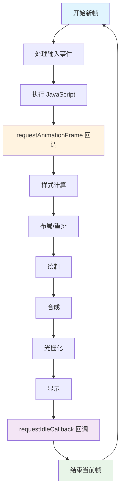

# 浏览器的一帧执行了哪些操作？

浏览器在渲染网页时，会以大约每秒 60 帧（即每 16.6 毫秒一帧）的速度更新屏幕，以实现流畅的视觉效果。这一过程涉及多个步骤，主要包括输入事件处理、JavaScript 执行、样式计算、布局、绘制、合成和显示，但并非每一帧都需完整执行所有步骤，浏览器会根据变化优化流程。如果页面无变化，浏览器可能跳过某些环节以节省资源。然而，在复杂交互或动画中，过多计算可能导致卡顿（jank）。

## 执行流程

### 输入事件处理（Input Event Handlers）

浏览器首先处理各种输入事件，确保用户交互的及时响应。

- 事件队列处理：浏览器维护一个事件队列，包含用户的各种交互事件，如鼠标点击、键盘输入、触摸事件、滚动事件等。在这个阶段，浏览器会从队列中取出事件并进行分发。
- 事件监听器执行：对于每个事件，浏览器会查找并执行相应的事件监听器。这些监听器可能包括用户自定义的事件处理函数，也可能包括浏览器内置的事件处理逻辑。
- 输入延迟优化：现代浏览器会采用各种策略来减少输入延迟，比如预测性滚动、触摸事件优化等。浏览器会分析用户的输入模式，提前准备可能的响应。
- 事件冒泡和捕获：浏览器会按照 DOM 树的结构，执行事件的捕获和冒泡过程，确保事件能够正确地传播到目标元素。

### JavaScript 执行（JavaScript Execution）

JavaScript 执行是浏览器渲染过程中的关键环节，它直接影响着页面的交互性和动态性。

- **主线程执行**：JavaScript 代码在浏览器的主线程中执行。主线程是单线程的，这意味着同一时间只能执行一个 JavaScript 任务。浏览器会按照一定的优先级来调度 JavaScript 的执行。
- **事件循环处理**：浏览器使用事件循环机制来管理 JavaScript 的执行。事件循环包含多个队列，包括**宏任务**队列（macro task queue）和**微任务**队列（micro task queue）。宏任务包括 `setTimeout`、`setInterval`、I/O 操作、事件处理函数、MessageChannel 的回调等，微任务包括 Promise 回调、`queueMicroTask`、MutationObserver 等。
- **requestAnimationFrame 回调**：在每一帧开始前，浏览器会执行通过 `requestAnimationFrame` 注册的回调函数。这些回调通常用于动画和 DOM 更新，确保与浏览器的刷新率同步。
- **定时器回调执行**：浏览器会检查定时器队列，执行到期的 `setTimeout` 和 `setInterval` 回调函数。这些回调函数会被添加到宏任务队列中，等待执行。
- **Promise 和异步操作处理**：对于 Promise、`async`/`await` 等异步操作，浏览器会在微任务队列中处理它们的回调函数。微任务具有高优先级，会在当前宏任务执行完毕后立即执行。
- **DOM 操作处理**：JavaScript 可能会对 DOM 进行各种操作，如创建、删除、修改元素，改变元素属性等。这些操作会触发后续的样式计算和布局阶段。
- **垃圾回收**：浏览器会在适当的时机进行垃圾回收，清理不再使用的内存。垃圾回收可能会暂停 JavaScript 的执行，影响页面的响应性。

### 样式计算（Style Calculation）

样式计算阶段负责确定每个元素应该具有的最终样式，这一过程具体包括下面这些步骤。

- CSS 规则解析：浏览器会解析所有的 CSS 规则，包括外部样式表、内部样式表和内联样式。解析过程包括词法分析、语法分析和语义分析。
- 选择器匹配：浏览器会为每个 DOM 元素找到所有匹配的 CSS 选择器。这个过程需要考虑选择器的优先级、特异性等因素。
- 样式继承计算：CSS 属性具有继承性，子元素会继承父元素的某些样式属性。浏览器需要计算每个元素从父元素继承的样式。
- 层叠规则应用：CSS 的层叠规则决定了当多个规则应用于同一个元素时，哪个规则会生效。浏览器需要按照层叠顺序（重要性、来源、特异性、顺序）来确定最终的样式。
- 伪元素和伪类处理：浏览器会处理 `:hover`、`:focus` 等伪类和 `::before`、`::after` 等伪元素，为这些虚拟元素计算样式。
- 媒体查询评估：如果页面包含媒体查询，浏览器需要评估当前的设备条件（如屏幕尺寸、分辨率等），确定哪些样式规则应该生效。
- CSS 变量解析：对于 CSS 自定义属性（CSS 变量），浏览器需要解析变量的值并应用到相应的元素上。

### 布局（Layout / Reflow）

布局阶段负责计算每个元素在页面中的确切位置和大小，这是渲染过程中计算量最大的阶段之一。

- 布局树构建：浏览器会基于 DOM 树和样式信息构建布局树（Layout Tree）。布局树包含了每个元素的位置、大小、边距、边框、内边距等几何信息。
- 盒模型计算：每个元素都遵循 CSS 盒模型，包括内容区域（content）、内边距（padding）、边框（border）和外边距（margin）。浏览器需要精确计算这些区域的尺寸。
- 定位计算：根据元素的 `position` 属性，浏览器会计算元素在页面中的确切位置。对于绝对定位和固定定位的元素，还需要考虑其包含块（containing block）的位置。
- 浮动处理：对于设置了 `float` 属性的元素，浏览器需要计算它们在文档流中的位置，并调整其他元素的位置以适应浮动元素。
- 弹性布局计算：如果使用了 Flex 布局，浏览器需要计算主轴和交叉轴的方向，分配可用空间，确定每个弹性项目的尺寸和位置。
- 网格布局计算：如果使用了 Grid 布局，浏览器需要计算网格线、网格区域，确定每个网格项目的位置和尺寸。
- 文本布局：对于文本内容，浏览器需要计算字符的宽度、行高、行间距，确定文本的换行位置和文本流的布局。
- 重排优化：浏览器会采用各种优化策略来减少重排的计算量，比如增量布局、脏区域标记等。只有当元素的几何属性发生变化时，才会触发重排。

### 绘制（Paint）

绘制阶段负责将布局阶段计算出的几何信息转换为实际的像素图像。

- 绘制列表生成：浏览器会为每个需要绘制的元素生成绘制指令列表。这些指令包括绘制矩形、圆形、文本、图像等操作。
- 图层绘制：现代浏览器使用分层渲染技术，将页面分为多个图层。每个图层可以独立绘制和合成，提高渲染效率。浏览器会在各自的图层上绘制内容。
- 颜色填充：浏览器会填充元素的背景色、边框色等。对于渐变背景，浏览器需要计算渐变的颜色分布。
- 文本渲染：文本渲染是一个复杂的过程，包括字符的栅格化、字体渲染、文本对齐等。浏览器需要将文本转换为像素图像。
- 图像处理：对于img元素和背景图像，浏览器需要解码图像数据，调整图像尺寸，应用滤镜效果等。
- 阴影和效果绘制：浏览器会绘制 `box-shadow`、`text-shadow` 等阴影效果，以及 `border-radius`、`clip-path` 等裁剪效果。
- 透明度处理：对于设置了 `opacity` 的元素，浏览器需要计算透明度效果，将元素与背景进行混合。

### 合成阶段（Compositing）

合成阶段负责将多个图层合成为最终的图像，这是现代浏览器渲染流程的最后阶段。

- 图层合成：浏览器会将多个图层按照一定的顺序合成为最终的图像。合成过程需要考虑图层的透明度、混合模式等因素。
- GPU 加速：现代浏览器会利用 GPU 进行硬件加速，将合成操作交给GPU处理。GPU 的并行处理能力可以大大提高合成效率。
- 变换处理：对于使用了 `transform` 属性的元素，浏览器会在合成阶段处理这些变换，包括平移、旋转、缩放、倾斜等。
- 透明度合成：对于设置了 `opacity` 的元素，浏览器会在合成阶段计算透明度效果，将元素与背景进行混合。
- 滚动优化：现代浏览器会对滚动进行优化，只重新合成可见区域的内容，而不是整个页面。
- 动画处理：对于 CSS 动画和过渡效果，浏览器会在合成阶段处理动画的帧间变化，实现平滑的动画效果。

### 光栅化阶段（Rasterization）

光栅化阶段负责将矢量图形转换为像素图像，这是显示过程的必要步骤。

- 矢量到像素转换：浏览器需要将 CSS 中定义的矢量图形（如矩形、圆形、文本等）转换为像素图像。这个过程包括几何计算、颜色填充等。
- 图像解码：对于图片元素，浏览器需要解码图像数据，将压缩的图像格式（如 JPEG、PNG、WebP 等）转换为像素数据。
- 抗锯齿处理：为了改善图像的视觉效果，浏览器会应用抗锯齿算法，平滑图像的边缘。
- 颜色空间转换：浏览器可能需要将图像从一种颜色空间转换为另一种颜色空间，以适应显示设备的要求。
- 图像缩放：如果图像的实际尺寸与显示尺寸不同，浏览器需要进行图像缩放，这可能涉及插值算法的应用。

### 显示阶段（Display）

显示阶段负责将最终的图像显示在屏幕上，这是整个渲染过程的最后一步。

- **帧缓冲管理**：浏览器会将合成的图像写入帧缓冲（Frame Buffer）。帧缓冲是内存中的一块区域，用于存储要显示的图像数据。
- **垂直同步**：浏览器会与显示器的刷新率进行同步，确保在显示器刷新时提供新的图像数据。这可以避免画面撕裂和卡顿。
- **屏幕显示**：显示控制器会从帧缓冲中读取图像数据，并通过显示接口（如 HDMI、DisplayPort 等）将图像发送到显示器。
- **色彩校正**：浏览器可能会应用色彩校正，确保在不同显示设备上显示的颜色一致。
- **性能监控**：浏览器会监控渲染性能，收集各种指标，如帧率、渲染时间等，用于性能优化和调试。

### requestIdleCallback 执行（可选）

当浏览器完成所有必要的工作后，如果还有剩余时间，会执行通过 `requestIdleCallback` 注册的回调函数。

- **空闲时间检测**：浏览器会检测当前帧是否有剩余时间
- **低优先级任务执行**：执行非关键的、可以延后的任务
- **时间限制**：通常限制在 5ms 以内，避免影响下一帧
- **任务调度**：可以用于数据预取、日志记录、性能分析等

## 参考

- [Chrome DevTools Performance](https://developer.chrome.com/docs/devtools/evaluate-performance/)
- [Web Vitals](https://web.dev/vitals/)
- [RenderingNG architecture](https://developer.chrome.com/docs/chromium/renderingng-architecture/)
- [The Rendering Critical Path](https://www.chromium.org/developers/the-rendering-critical-path/)
- [真正理解浏览器渲染更新流程](https://blog.csdn.net/weixin_52834435/article/details/133468543)
- [The Anatomy of a Frame](https://aerotwist.com/blog/the-anatomy-of-a-frame/)
- [Deep Dive into the Browser's Rendering Pipeline](https://medium.com/stackademic/deep-dive-into-the-browsers-rendering-pipeline-4c88c91f7bdc)
- [Optimize JavaScript Execution](https://web.dev/optimize-javascript-execution/)
- [Reduce the Scope and Complexity of Style Calculations](https://web.dev/reduce-the-scope-and-complexity-of-style-calculations/)
- [Avoid Large, Complex Layouts and Layout Thrashing](https://web.dev/avoid-large-complex-layouts-and-layout-thrashing/)
- [Simplify Paint Complexity and Reduce Paint Areas](https://web.dev/simplify-paint-complexity-and-reduce-paint-areas/)
