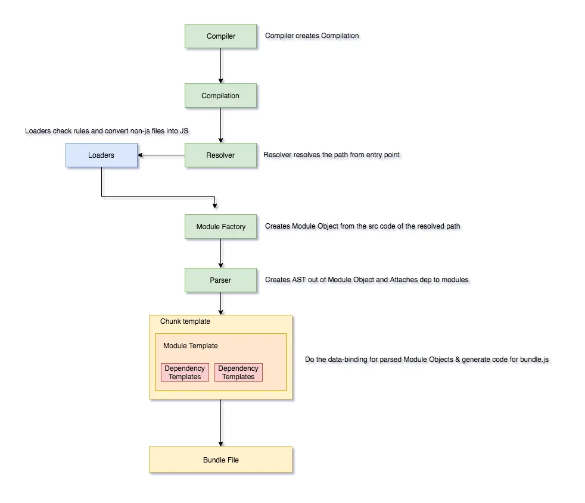

# 编写 Loader 和 Plugin

## 一、webpack 构建流程

<!-- TODO：构建流程 -->



<!-- https://imranhsayed.medium.com/webpack-behind-the-scenes-85333a23c0f6 -->

## 二、编写 Loader

### 2.1 介绍

loader 本质上是导出为函数的 JavaScript 模块。

```javascript
// my-first-loader.js

module.exports = function(content, map, meta) {
  console.log(content);
  return content;
}
```

它的使用方式跟其它 loader 一样，只需在 webpack 配置文件中导入就可以。

```javascript
module.exports = {
  module: {
    rules: [
      {
        test: /\.js$/i,
        loader: './my-first-loader',
      },
    ],
  }
};
```

上面代码中，当匹配到 `.js` 结尾的文件，就会执行我们定义的 loader 函数，她接受三个参数。

- `content`：当前匹配到的源文件的内容。
- `map`：跟 source map 有关的数据。
- `meta`：其他 loader 传递过来的数据。

注意，loader 函数执行完后，要将处理的内容返回给 webpack。

### 2.2 Loader Interface

[Loader Interface](https://webpack.docschina.org/api/loaders/) 是 webpack 提供的、用于操作 Loader 的 API 接口，要想自定义 Loader，必须对它有所了解。

Loader Interface 中，规定了四种类型的 loader：**同步 Loader**、**异步 Loader**、**Raw Loader** 和 **Pitching Loader**。下面分别对他们进行介绍。

#### 2.2.1 分类

（1）同步 Loader

同步 Loader 执行的同步操作，对于转换后的内容，可以使用 `this.callback` 或者 `return` 返回。推荐的做法是使用前者，应为它可以传递更多参数。

```javascript
// 方式一：使用 this.callback
module.exports = function (content, map, meta) {
  this.callback(
    null, // 函数执行过程中，抛出的错误
    someSyncOperation(content),
    map,
    meta,
  );
};

// 方式二：直接返回处理结果
module.exports = function (content, map, meta) {
  return someSyncOperation(content);
};
```

（2）异步 Loader

异步 Loader 允许执行异步操作。对于异步 loader，使用 `this.async` 来获取 callback 函数。

```javascript
module.exports = function (content, map, meta) {
  const callback = this.async();
  someAsyncOperation(content, function (err, result) {
    if (err) return callback(err);
    callback(null, result, map, meta);
  });
};
```

（3）Raw Loader

默认情况下，资源文件会被转化为 UTF-8 字符串，然后传给 loader。通过设置 `raw` 为 `true`，loader 可以接收原始的 Buffer。每一个 loader 都可以用 String 或者 Buffer 的形式传递它的处理结果。complier 将会把它们在 loader 之间相互转换。

```javascript
module.exports = function (content) {
  assert(content instanceof Buffer);
  return someSyncOperation(content); // 返回值也可以是一个 `Buffer`
};

module.exports.raw = true;
```

（4）Pitching Loader

loader 总是从右到左或者从下往上被调用。有些情况下，loader 只关心 request 后面的元数据（metadata），并且忽略前一个 loader 的结果。在实际（从右到左）执行 loader 之前，会先 **从左到右** 调用 loader 上的 `pitch` 方法。

```javascript
module.exports = {
  module: {
    rules: [
      {
        use: ['a-loader', 'b-loader', 'c-loader'],
      },
    ],
  },
};
```

上面的配置，会按照下面的顺序执行。

```text
|- a-loader `pitch`
  |- b-loader `pitch`
    |- c-loader `pitch`
      |- requested module is picked up as a dependency
    |- c-loader normal execution
  |- b-loader normal execution
|- a-loader normal execution
```

也就是说，先按照从左到右的顺序执行 `a`、`b`、`c` 的 `pitch` 方法，然后按照从右到左的顺序执行 loader。

传递给 `pitch` 方法的 data，在执行阶段也会暴露在 `this.data` 之下，并且可以用于在循环时，捕获并共享前面的信息。

```javascript
module.exports = function (content) {
  return someSyncOperation(content, this.data.value);
};

module.exports.pitch = function (remainingRequest, precedingRequest, data) {
  data.value = 42;
};
```

其次，如果某个 loader 在 `pitch` 方法中给出一个结果，那么这个过程会回过身来，并跳过剩下的 loader。在我们上面的例子中，如果 `b-loader` 的 `pitch` 方法返回了一些东西，那么，他们的执行顺序又会不同。

```javascript
module.exports = function (content) {
  return someSyncOperation(content);
};

module.exports.pitch = function (remainingRequest, precedingRequest, data) {
  if (someCondition()) {
    return (
      'module.exports = require(' +
      JSON.stringify('-!' + remainingRequest) +
      ');'
    );
  }
};
```

此时的执行结果如下。

```text
|- a-loader `pitch`
  |- b-loader `pitch` returns a module
|- a-loader normal execution
```

#### 2.2.2 Loader Context

loader context 表示在 loader 函数中使用 `this` 可以访问的一些方法或属性。

- `context`：表示当前模块所在的目录路径。这个路径是模块文件的父目录的绝对路径。
- `data`：一个可由 loader 自由使用的对象，用于在 loader 链中传递自定义数据。
- `fs`：提供对 Webpack 输入文件系统的访问。
- `query`：表示传递给 loader 的配置选项（即 webpack 配置中的 options 或查询字符串）。
- `loaders`：所有 loader 组成的数组。在 pitch 阶段的时候可以写入。
- `mode`：表示 webpack 的运行模式（`'development'`、`'production'` 或 `undefined`）。
- `resource`：表示当前模块的完整文件路径（包括文件名和扩展名）。
- `async()`：用于将 loader 转换为异步模式。调用 `this.async()` 会返回一个回调函数（类似于 `this.callback`），用于异步返回结果。
- `callback(err: Error | null, content?: string | Buffer, sourceMap?: SourceMap, meta?: any)`：一个异步回调函数，用于将 loader 的处理结果返回给 Webpack。
- `emitFile(name: string, content: string | Buffer, sourceMap?: SourceMap)`：用于将文件输出到 webpack 的输出目录。
- `getOptions(schema)`：返回 loader 的配置选项。
- `utils.contextify(context: string, request: string)`：将给定的请求路径（`request`）转换为相对于指定上下文路径（`context`）的相对路径。
- `utils.absolutify(context: string, request: string)`：将给定的请求路径（`request`）转换为相对于指定上下文路径（`context`）的绝对路径。
- `utils.stringifyRequest(context: string, request: string)`：将模块请求字符串（`request`）转换为一个 JSON 格式的字符串，适用于在 JavaScript 代码中嵌入请求。
- `utils.createHash(type: string)`：创建一个指定类型的哈希对象，用于生成内容的哈希值。
- `resolve(context: string, request: string, callback: function(err: Error | null, result: string))`：用于解析模块路径，类似于 Webpack 的 `require.resolve`。

[Loader Context](https://webpack.docschina.org/api/loaders/#the-loader-context) 还有很多其他属性没有列出，可以去参考。

## 三、编写 Plugin

### 3.1 介绍

插件本质上是一个具有 `apply` 方法的类或者函数。`apply` 方法定义在函数的 `prototype` 上，并且会在插件被初始化时调用，所有的钩子函数，都要注册在 `apply` 方法中。`apply` 方法接收到一个 `compiler` 作为参数，整个编译生命周期都可以访问 `compiler` 对象。

webpack 在编译过程中，会在不同的阶段广播不同的生命周期钩子，插件的实现原理，就是在这些不同的生命周期钩子中，执行相应的操作。目前，所有的钩子都注册在 `compiler` 和 `compilation` 对象上。

钩子又分为同步钩子和异步钩子。同步钩子使用 `async` 方法注册，异步钩子使用 `async`、`tapAsync` 或者 `tapPromise` 方法注册。

```javascript
class MyFirstPlugin {
  constructor() { }
  apply(compiler) {
    compiler.hooks.emit.tapAsync(
      'MyFirstPlugin',
      (compilation, callback) => {
        // ...
        callback();
      }
    );
  }
}

module.exports = MyFirstPlugin;
```

#### 3.1.1 Tapable

Tapable 库是 webpack 的一个核心工具，它通过提供钩子（hooks）机制，允许开发者在 Webpack 构建过程中的特定点注入自定义逻辑。Tapable 支持同步和异步操作，类似于“**发布-订阅**”模式，但更灵活，并提供了 `tap`、`tapAsync` 和 `tapPromise` 方法，用于向 webpack 中注入自定义构建的步骤，这些步骤将在构建过程中触发。

- `tap`：用于注册同步钩子和异步钩子。
- `tapAsync`：用于使用回调方式注册异步钩子。
- `tapPromise`：用于使用 Promise 方式注册异步钩子。

Tapable 提供了多种类型的 hooks 类，可以使用他们来构建 hooks。

- SyncHook
- SyncBailHook
- SyncWaterfallHook
- SyncLoopHook
- AsyncParallelHook：异步并行钩子，对于多个同名钩子，异步执行。
- AsyncParallelBailHook
- AsyncSeriesHook：异步穿行钩子，对于多个同名的钩子，按照顺序执行。
- AsyncSeriesBailHook
- AsyncSeriesWaterfallHook

#### 3.1.2 Compiler

Compiler 是 Webpack 的主引擎，负责管理整个构建过程，包括接收配置选项并创建 Compilation 实例。Compiler 钩子是 Compiler 对象上定义的一系列钩子，用于在构建过程的关键阶段触发插件逻辑。这些钩子主要关注全局性事件，适合处理整个构建过程的高级操作。

`compiler` 对象上的生命周期钩子，要通过 `compiler.hooks.<hook name>.call` 的形式注册。

```javascript
compiler.hooks.environment.tap('MyPlugin', (params) => {
  /* ... */
});
```

上面代码中，在 `environment` 钩子上通过 `tap` 的形式，注册了一个钩子函数，会掉函数会在插件初始化完成后执行。

下面列出了 `compiler` 中的 hooks，他们按照执行顺序排列。

- **`environment`**（`SyncHook`）：在编译器准备环境时调用，通常在插件初始化后调用，设置初始环境。
- `afterEnvironment`（`SyncHook`）：编译器环境设置完成后调用，确保环境已准备好进行后续处理。
- `entryOption`（`SyncBailHook`）：在 webpack 选项中的 `entry` 被处理后调用。
- `afterPlugins`（`SyncHook`）：内部插件集合设置完成后触发，确保所有内部插件已初始化。
- `afterResolvers`（`SyncHook`）：解析器（`resolver`）设置完成后触发，允许对解析器进行自定义。
- **`initialize`**（`SyncHook`）：编译器对象初始化时触发，标志着编译器设置的开始。
- `beforeRun`（`AsyncSeriesHook`）：编译器运行前触发，允许在构建开始前进行准备工作。
- **`run`**（`AsyncSeriesHook`）：读取记录（records）前触发，负责初始化构建并处理记录。
- `watchRun`（`AsyncSeriesHook`）：Watch 模式下触发，用于处理文件变化后的重新编译。
- `normalModuleFactory`,（`SyncHook`）：NormalModuleFactory 创建后触发，允许自定义模块工厂。
- `contextModuleFactory`,（`SyncHook`）：ContextModuleFactory 创建后触发，处理上下文模块。
- **`beforeCompile`**,（`AsyncSeriesHook`）：编译参数（compilation parameter ）创建后触发，允许修改编译参数。
- **`compile`**,（`SyncHook`）：新编译创建前触发，不被子编译器复制，标志着编译过程的开始。
- **`thisCompilation`**,（`SyncHook`）：编译（compilation）初始化期间触发，允许在编译事件前进行设置。
- **`compilation`**,（`SyncHook`）：编译对象（compilation）创建后触发，允许与编译对象交互。
- **`make`**,（`AsyncParallelHook`）：编译（compilation）结束前触发，处理模块和依赖图的并行任务。
- **`afterCompile`**,（`AsyncSeriesHook`）：编译（compilation）结束并封闭后触发，确保后编译任务完成。
- `shouldEmit`,（`SyncBailHook`）：发射资产前触发，返回布尔值决定是否发射。
- **`emit`**（`AsyncSeriesHook`）：输出资产（asset）到指定目录前触发。
- `afterEmit`（`AsyncSeriesHook`）：资产输出后触发。
- `assetEmitted`（`AsyncSeriesHook`）：资产发射时触发，提供资产信息，允许访问细节。
- **`done`**（`AsyncSeriesHook`）：编译（compilation）完成时触发，提供构建统计信息，标志构建结束。
- `additionalPass`（`AsyncSeriesHook`）：允许额外的构建传递，支持迭代式构建。
- `failed`（`SyncHook`）：编译（compilation）失败时触发，处理错误情况。
- `invalid`（`SyncHook`）：Watch 模式下文件变化时触发，处理重新编译。
- `watchClose`（`SyncHook`）：Watch 模式停止时触发，处理清理工作。
- `shutdown`（`AsyncSeriesHook`）：编译器关闭时触发，确保 Proper 关闭。
- `infrastructureLog`（`SyncBailHook`）：启用基础设施日志时触发，方便调试。
- `log`（`SyncBailHook`）：启用统计日志时触发，支持详细日志记录。

#### 3.1.3 Compilation

Compilation 是 Webpack 中表示**单次构建过程**的对象，包含所有模块、依赖关系和生成的资源信息。Compilation 钩子是 Compilation 对象上定义的一系列钩子，用于在构建过程中更细粒度的阶段触发插件逻辑。这些钩子关注单次构建的具体细节，适合处理模块优化、资源生成等操作。

Compilation 模块会被 Compiler 用来创建新的 `compilation` 对象（或新的 build 对象）。 `compilation` 实例能够访问所有的模块和它们的依赖（大部分是循环依赖）。 它会对应用程序的依赖图中所有模块， 进行字面上的编译（literal compilation）。

在编译阶段，模块会被加载（load）、封存（seal）、优化（optimize）、分块（chunk）、哈希（hash）和重新创建（restore）。

Compilation 类扩展自 Tapable，使用 `tap`、`tapAsync` 和 `tapPromise` 来注册钩子。

```javascript
compilation.hooks.[someHook].tap(/* ... */);
```

`compilation` 钩子可分为模块构建阶段、优化阶段和资产处理阶段三大类。

下面按逻辑顺序列出了所有钩子，执行顺序基于其触发时机描述。

##### （1）模块构建阶段

- **`buildModule`**（SyncHook）：模块构建开始前触发，可用于修改模块。适用于需要调整模块内容的插件。
- `rebuildModule`（SyncHook）：模块重建前触发。常见于watch模式下。
- `failedModule`（SyncHook）：模块构建失败时触发。用于错误处理和日志记录。
- **`succeedModule`**（SyncHook）：模块构建成功时触发。适用于成功构建后的操作。
- **`finishModules`**（AsyncSeriesHook）：所有模块无错误构建完成后触发。标志模块构建阶段结束。
- **`finishRebuildingModule`**（SyncHook）：模块重建完成（成功或失败）时触发。适用于watch模式场景。

##### （2）优化阶段

- **`seal`**（SyncHook）：编译停止接受新模块时触发。是添加资产或进行最终调整的关键点。
- `unseal`（SyncHook）：编译开始接受新模块时触发。
- **`optimizeDependencies`**（SyncBailHook）：依赖优化开始时触发。适用于优化依赖关系的插件。
- `afterOptimizeDependencies`（SyncHook）：依赖优化完成后触发。适用于优化后的操作。
- **`afterChunks`**（SyncHook）：块和模块图创建后、优化前触发。自 Webpack 5.83.0 起可用，适用于早期块操作。
- **`optimize`**（SyncHook）：优化阶段开始时触发。通用优化插件的入口。
- **`optimizeModules`**（SyncBailHook）：模块优化开始时触发。适用于模块优化。
- `afterOptimizeModules`（SyncHook）：模块优化完成后触发。适用于优化后的操作。
- **`optimizeChunks`**（SyncBailHook）：块优化开始时触发。适用于块优化。
- `afterOptimizeChunks`（SyncHook）：块优化完成后触发。适用于优化后的操作。
- **`optimizeTree`**（AsyncSeriesHook）：依赖树优化前触发。适用于树摇和依赖优化。
- `afterOptimizeTree`（SyncHook）：依赖树优化完成后触发。适用于优化后的操作。
- **`optimizeChunkModules`**（SyncBailHook）：树优化后，块模块优化开始时触发。适用于块内模块优化。
- `afterOptimizeChunkModules`（SyncHook）：块模块优化完成后触发。适用于优化后的操作。
- `shouldRecord`（SyncBailHook）：确定是否存储记录。适用于管理持久化数据的插件。
- `reviveModules`（SyncHook）：从记录恢复模块信息。适用于使用持久化数据的插件。
- `beforeModuleIds`（SyncHook）：分配模块 ID 前触发。
- `moduleIds`（SyncHook）：分配模块ID时触发。适用于控制模块ID的插件。
- `optimizeModuleIds`（SyncHook）：模块ID优化开始时触发。适用于优化模块ID。
- `afterOptimizeModuleIds`（SyncHook）：模块 ID 优化完成后触发。
- `reviveChunks`（SyncHook）：从记录恢复块信息。适用于使用持久化数据的插件。
- `beforeChunkIds`（SyncHook）：分配块 ID 前触发。
- `chunkIds`（SyncHook）：分配块 ID 时触发。适用于控制块ID的插件。
- `optimizeChunkIds`（SyncHook）：块 ID 优化开始时触发。适用于优化块 ID。
- `afterOptimizeChunkIds`（SyncHook）：块 ID 优化完成后触发。
- `recordModules`（SyncHook）：存储模块信息到记录。适用于管理持久化数据的插件。
- `recordChunks`（SyncHook）：存储块信息到记录。适用于管理持久化数据的插件。
- `beforeModuleHash`（SyncHook）：模块哈希前触发。
- `afterModuleHash`（SyncHook）：模块哈希后触发。
- `beforeHash`（SyncHook）：编译哈希前触发。
- `afterHash`（SyncHook）：编译哈希后触发。
- `recordHash`（SyncHook）：存储记录哈希信息。适用于管理持久化数据的插件。

##### （3）资产处理阶段

- `beforeModuleAssets`（SyncHook）：模块资产创建前触发。适用于准备模块资产的插件。
- **`additionalChunkAssets`**（SyncHook）：为块创建额外资产。适用于添加块额外资产的插件。
- **`shouldGenerateChunkAssets`**（SyncBailHook）：确定是否生成块资产。适用于控制资产生成的插件。
- `beforeChunkAssets`（SyncHook）：块资产生成前触发。适用于准备块资产的插件。
- **`additionalAssets`**（SyncHook）：创建额外资产。适用于添加额外资产的插件。
- `chunkAsset`（SyncHook）：块资产创建时触发，。适用于响应块资产创建的插件。
- **`assets`**（SyncHook）：所有资产创建完成后触发。适用于操作最终资产集的插件。
- `afterOptimizeAssets`（AsyncSeriesHook）：资产优化完成后触发。适用于优化后的操作。
- **`processAssets`**（AsyncSeriesHook）：处理资产过程中触发。适用于修改资产的插件。
- `afterProcessAssets`（AsyncSeriesHook）：资产处理完成后触发。适用于处理后的操作。
- `needAdditionalSeal`（SyncBailHook）：确定是否需要额外密封。适用于需要多次密封的插件。
- `additionalSeal`（AsyncSeriesHook）：执行额外密封。适用于需要多次密封的插件。
- **`afterSeal`**（AsyncSeriesHook）：密封完成后触发。适用于密封后的操作。
- **`chunkHash`**（SyncHook）：生成块哈希时触发。适用于自定义块哈希的插件。
- `moduleAsset`（SyncHook）：模块资产创建时触发。适用于响应模块资产创建的插件。
- **`assetPath`**（SyncHook）：确定资产路径时触发。适用于控制资产路径的插件。
- `needAdditionalPass`（SyncBailHook）：确定是否需要额外传递。适用于需要多次传递的插件。
- `childCompiler`（SyncHook）：子编译器设置完成后触发。适用于使用子编译器的插件。
- `statsPreset`（HookMap）：管理统计预设。适用于定制统计输出的插件。
- `statsNormalize`（SyncHook）：将选项对象转换为一致格式。适用于统计定制。

<!-- #### 2.1.4 webpack 工作流 -->
